# Temperatura-Humedad-Relativa-Direccion-y-Velocidad-del-Viento-Ciudad-de-Mexico-2015-a-2023-Python

**Lenguaje: Python 3.x**

**Librerías: Pandas, Matplotlib, Seaborn, NumPy**

**Entorno: Google Colab / Jupyter Notebook**

## Este proyecto contiene un análisis técnico de datos obtenidos de estaciones meteorológicas referentes a temperatura, humedad relativa, velocidad del viento y dirección del viento. Esto permite identifcar patrones en diferentes periodos de tiempo determinados de las diferentes condiciones atmosféricas en la Ciudad de México, así como su variabilidad.

**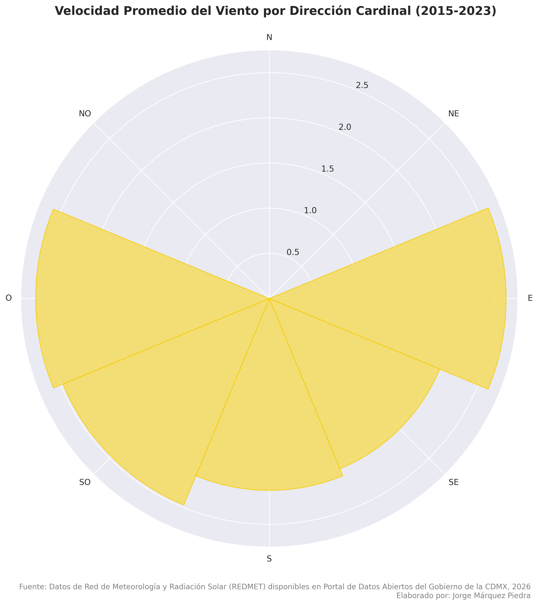**

****

**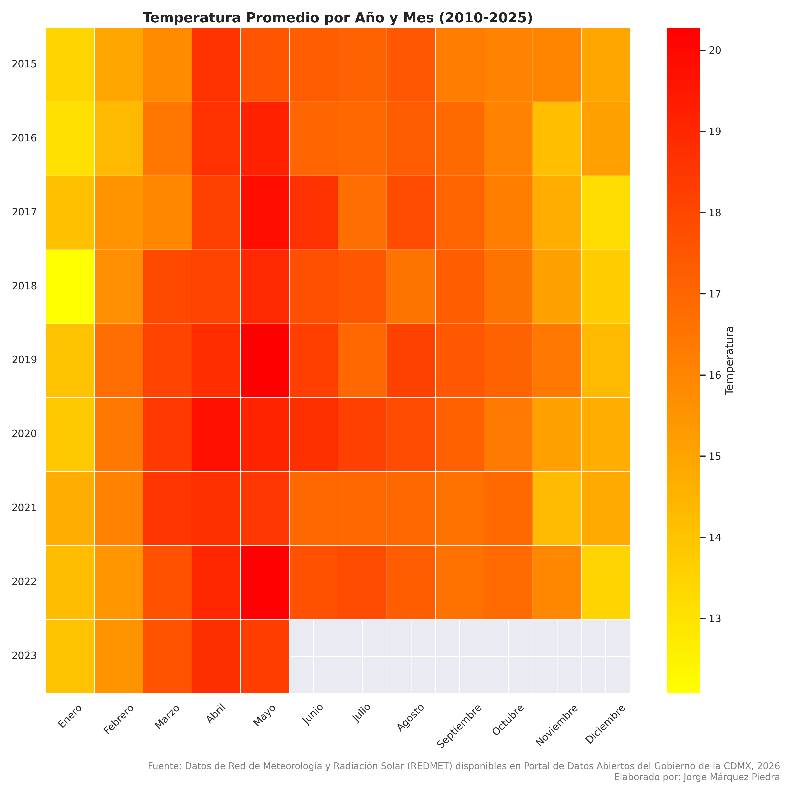**

**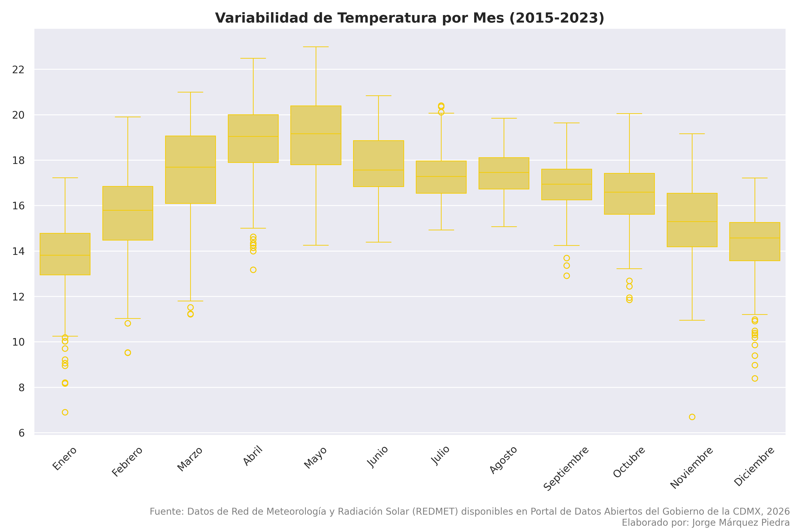**

****

**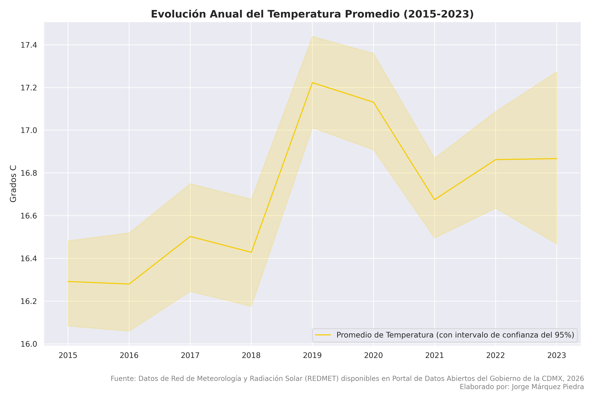**

**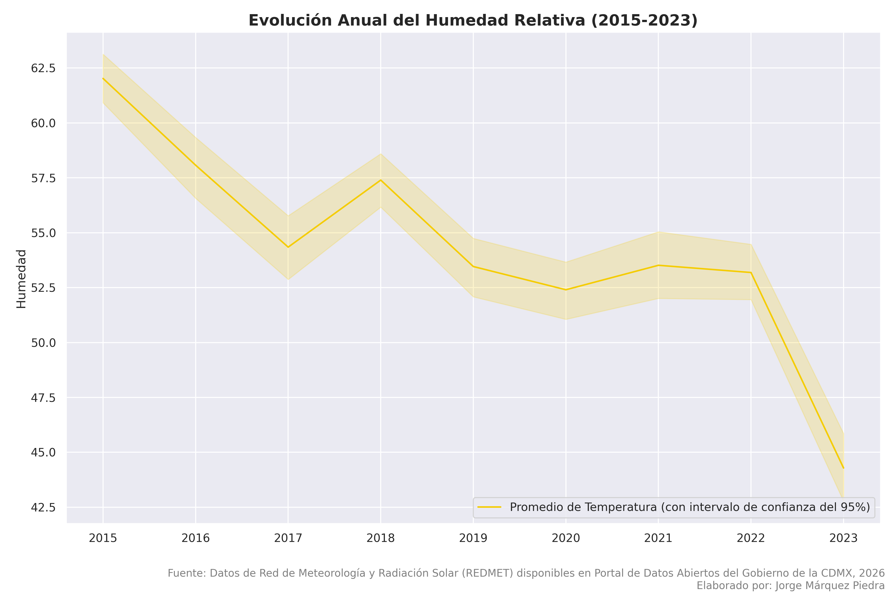**

**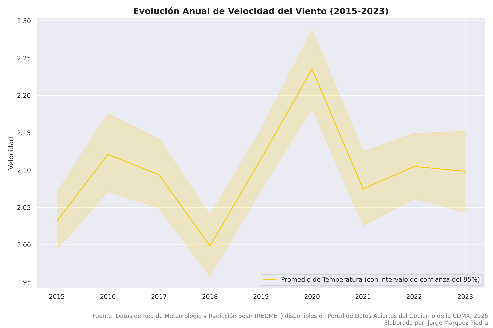**

**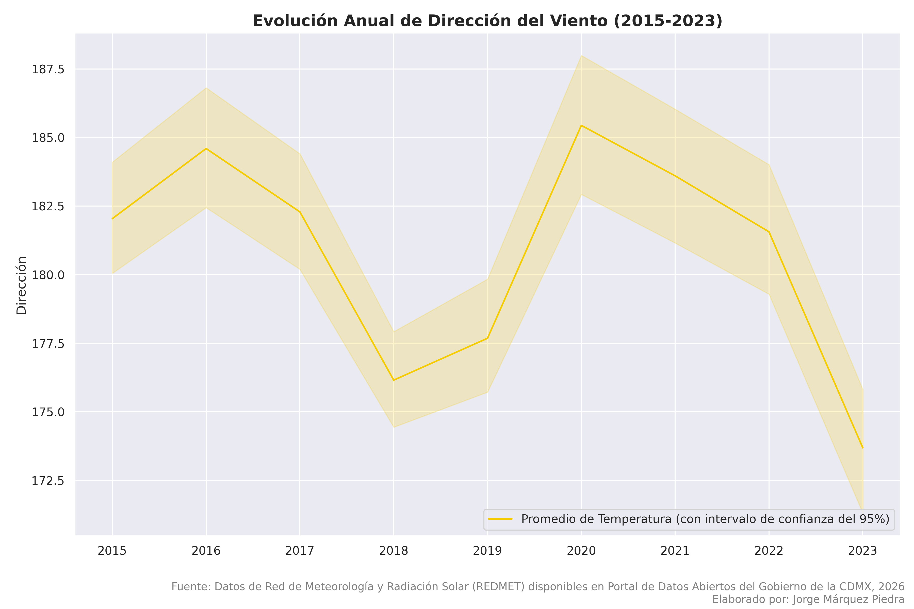**

**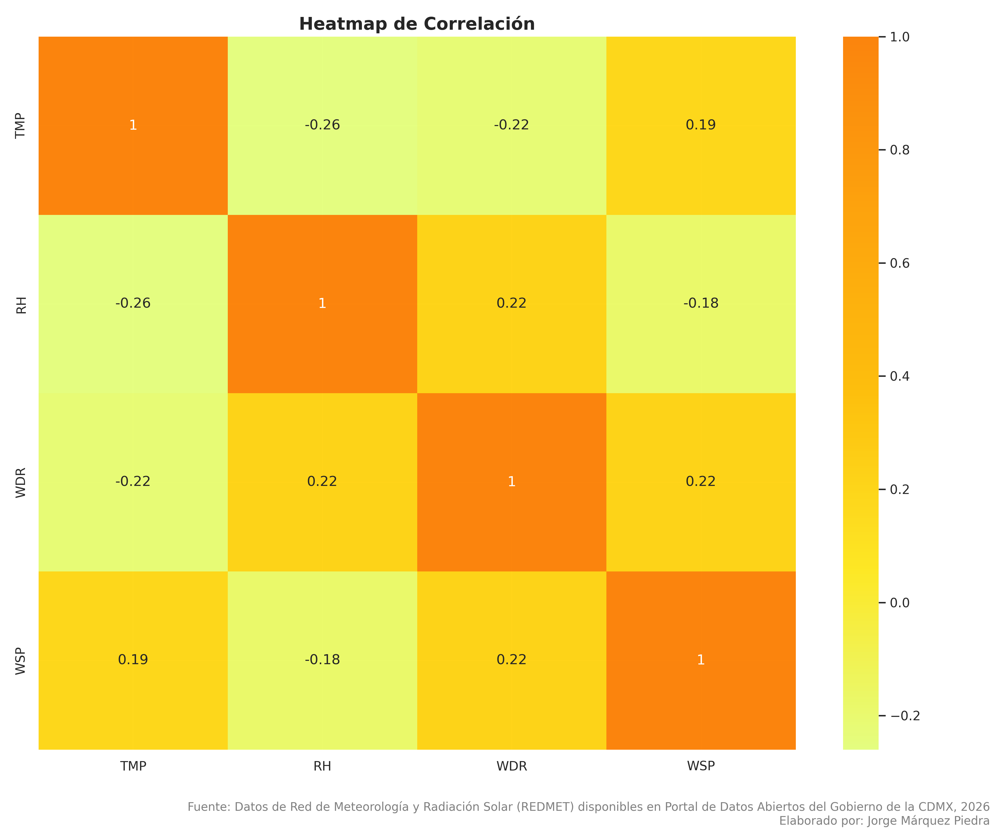**

**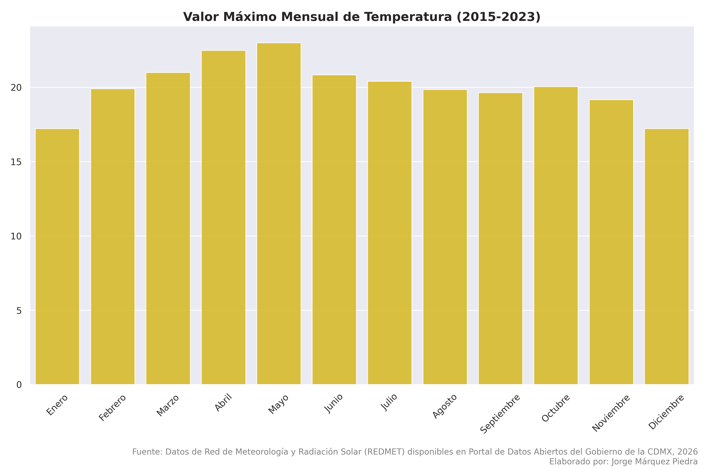**

**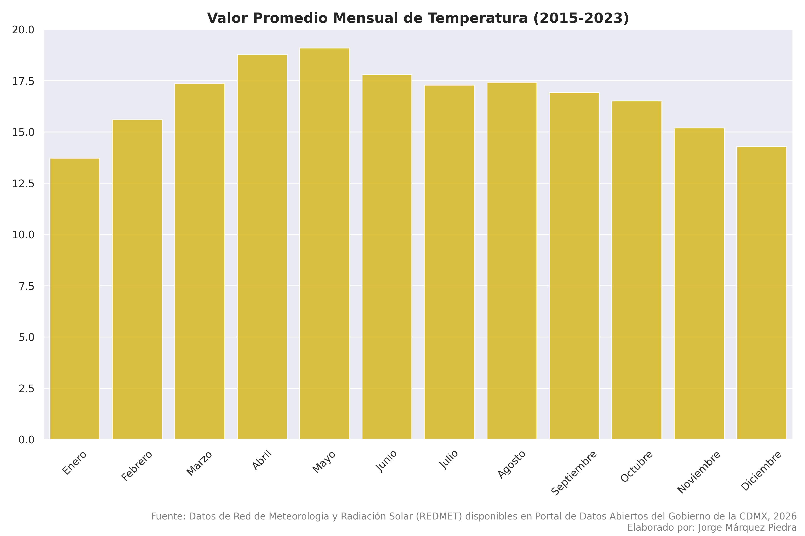**

**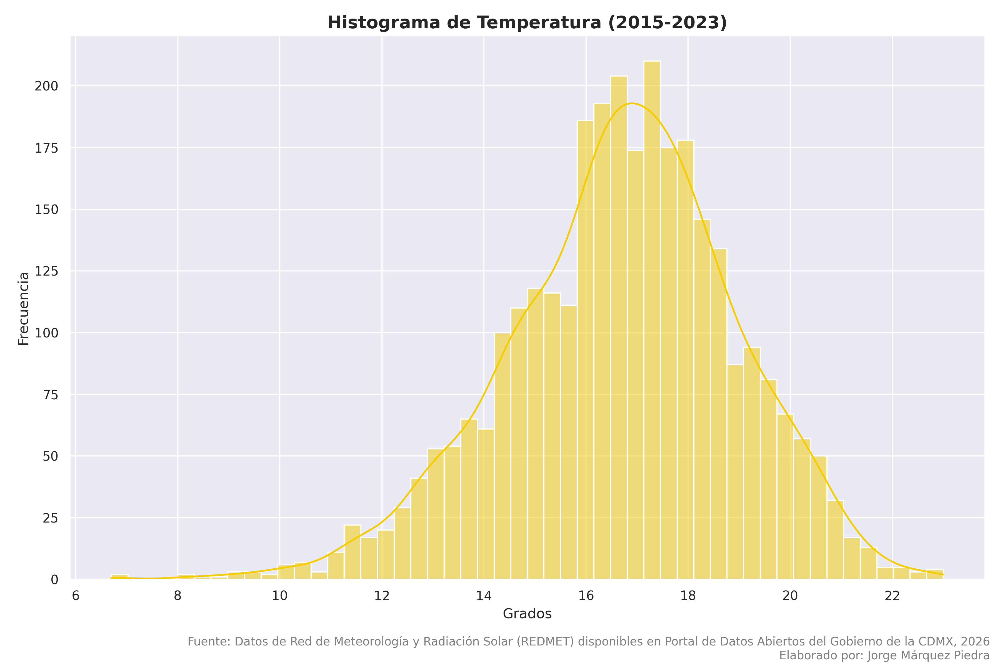**

**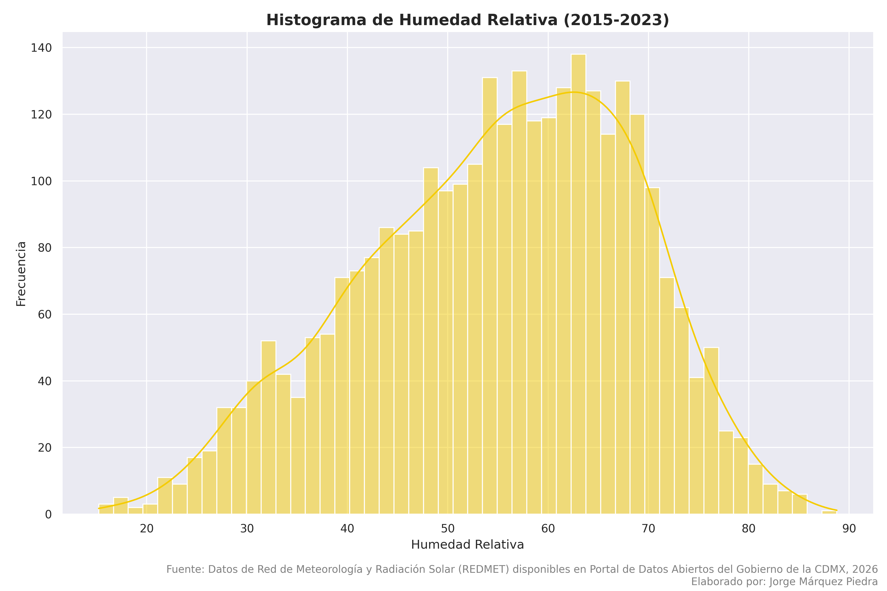**

**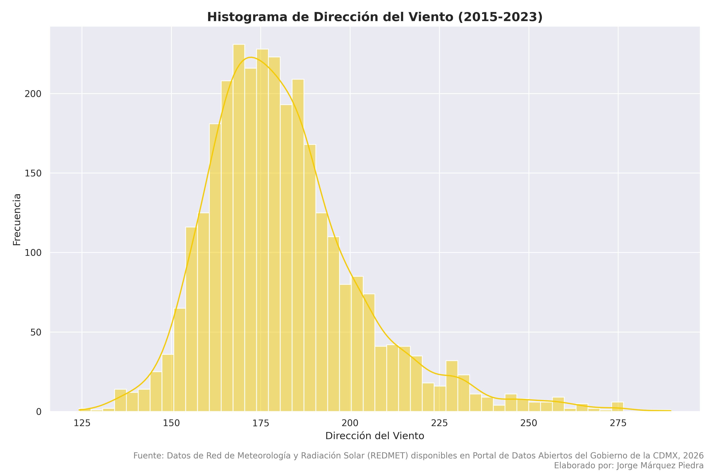**

**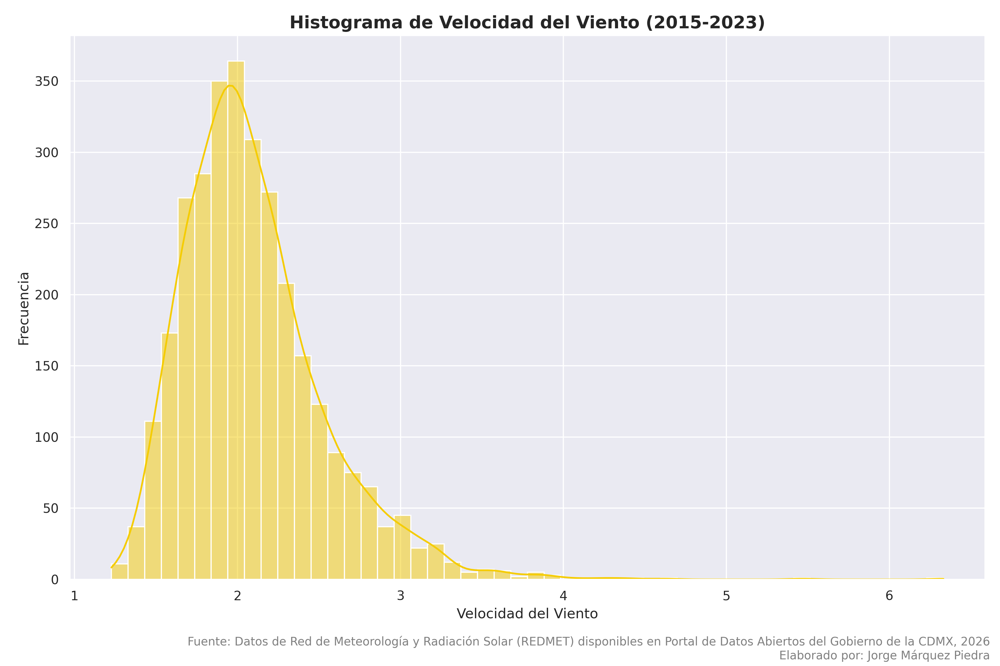**

## Los datos fueron obtenidos del [Portal de Datos Abiertos de la Ciudad de México](https://datos.cdmx.gob.mx/).
